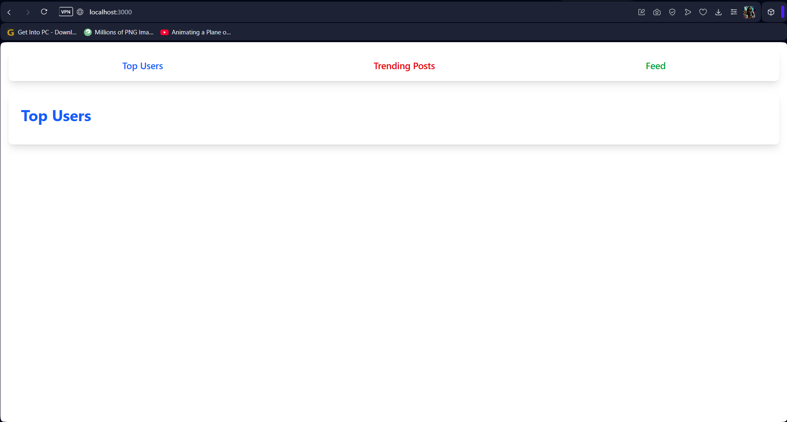
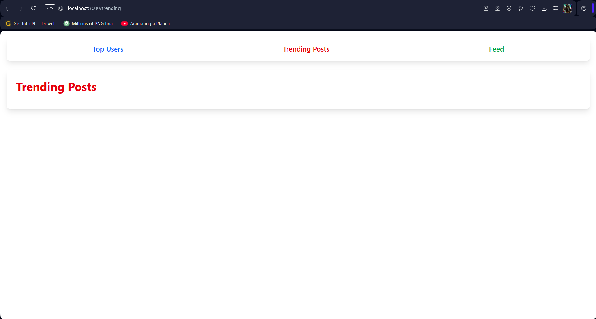
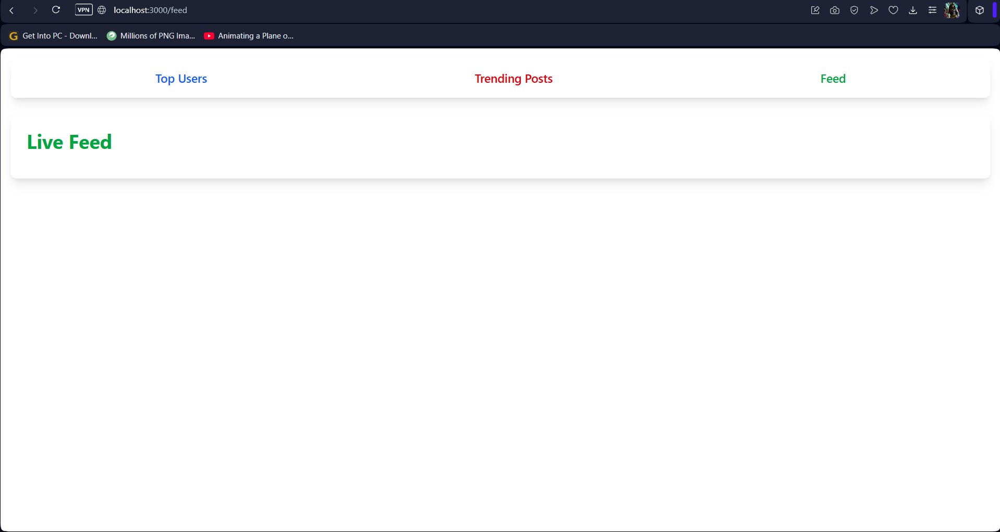
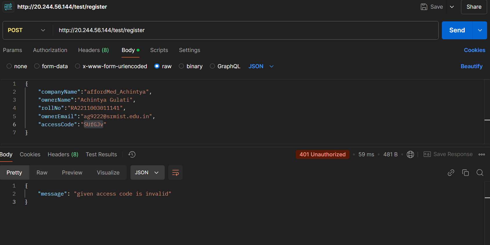
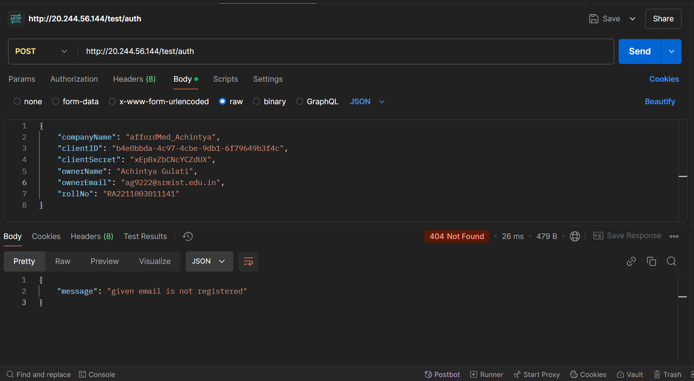

# Social Media Analytics

A React-based social media analytics frontend web application that provides real-time insights on user activity, trending posts, and a live feed.

## Features

- **Top Users**: Displays the top 5 users with the highest number of posts.
- **Trending Posts**: Shows the posts with the maximum number of comments.
- **Live Feed**: Continuously updates and displays the latest posts in real-time.
- **Responsive Design**: Built with Tailwind CSS for an optimized user experience.
- **Dynamic API Integration**: Fetches data from a backend API using Axios.

## Tech Stack

- React.js
- React Router
- Tailwind CSS
- Axios

## Screenshots

### Top Users Page

### Trending Posts Page

### Live Feed Page

### Test Server Error

## API Endpoints
- `GET /users` - Fetch top users based on post count
- `GET /posts?type=popular` - Fetch trending posts
- `GET /posts?type=latest` - Fetch live feed posts

